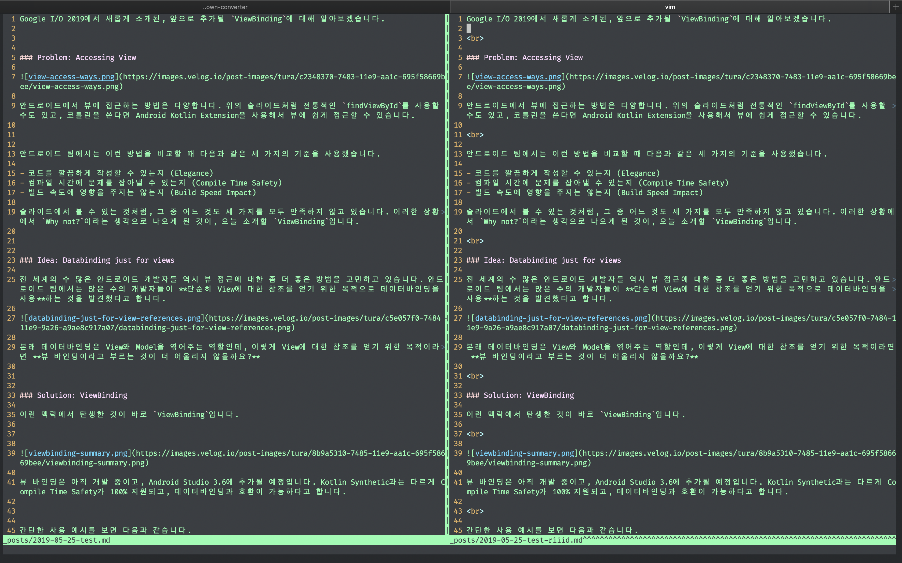
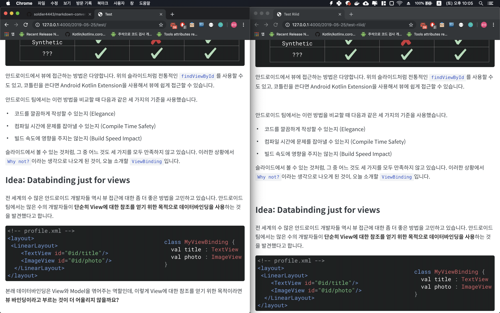

# Markdown Converter

Easily publish blog posts on different platforms.


## Examples

##### Markdown:



##### Image:




## Background

Many platforms support different styles for markdown.

I'm using [Typora](https://typora.io/), which is super cool markdown editor, but when i publish a new article to my personal blog or my company's blog, It shows differently.

So I created this small scripts, which **converts Typora-style markdown to my desired style markdown.**


## Installation

Install from the releases.

```
$ curl -sSLO https://github.com/soldier4443/markdown-converter/releases/download/0.1.0/mc && chmod a+x mc
```

You can also download it from https://github.com/soldier4443/markdown-converter/releases


## Use

Copy the `mc` executable to your path that you like. (e.g. /Users/your-name/bin)

Make sure that those directories are properly listed in $PATH variable.

```
mc --help             # See help
mc -p velog input.md  # Convert 'Typora' style markdown to 'velog' style markdown.
```


#### Supported platforms

| platform | description      |
|----------|------------------|
| velog    | https://velog.io |
| riiid    | riiid dev blog   |